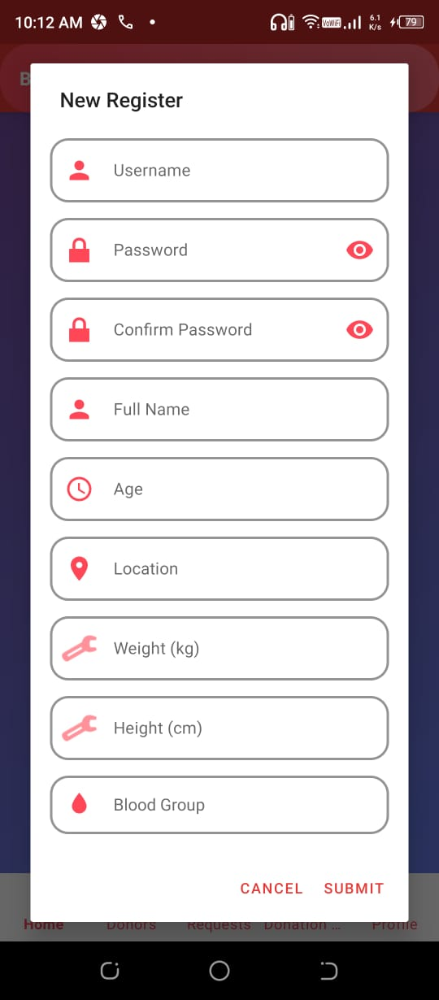
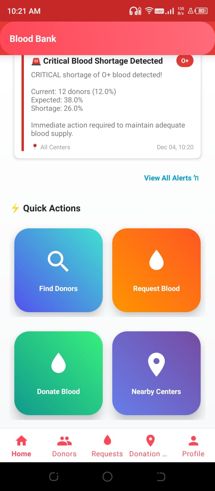
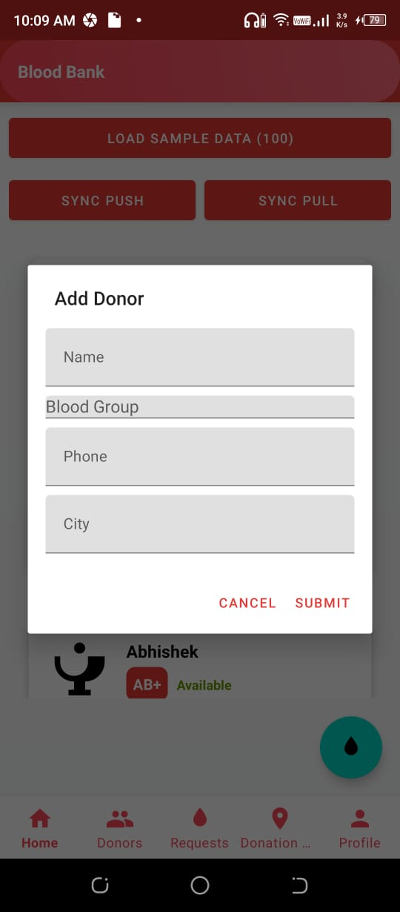
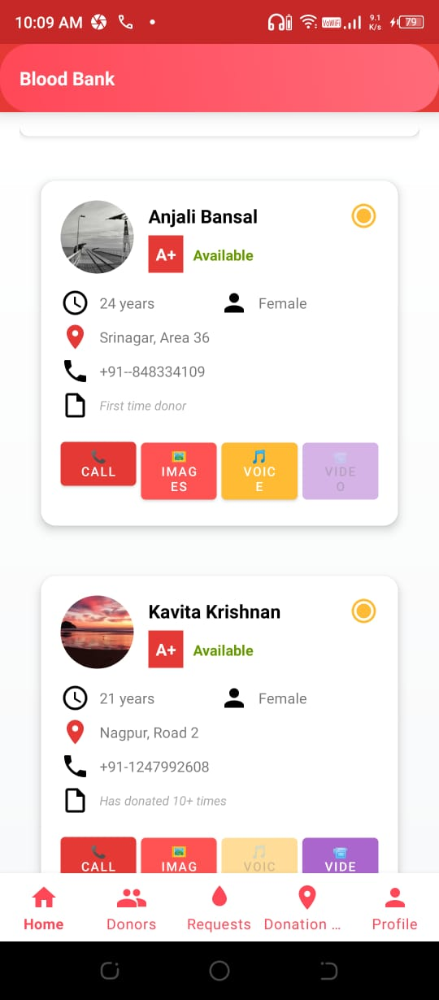
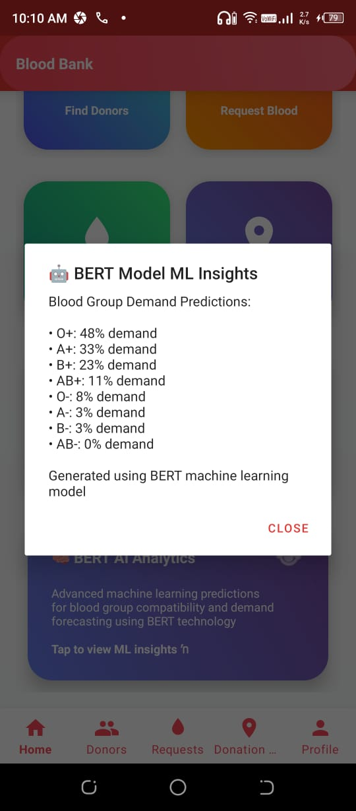
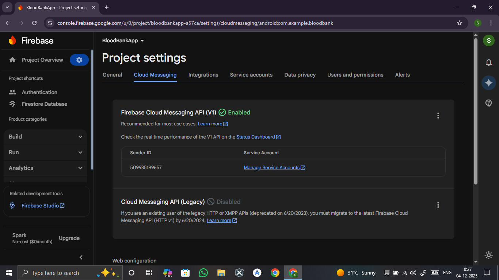
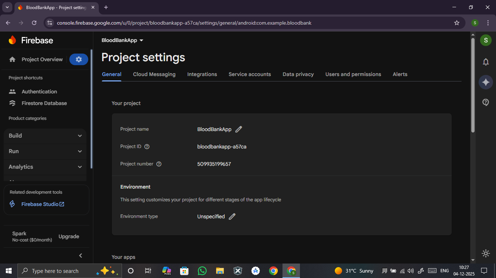
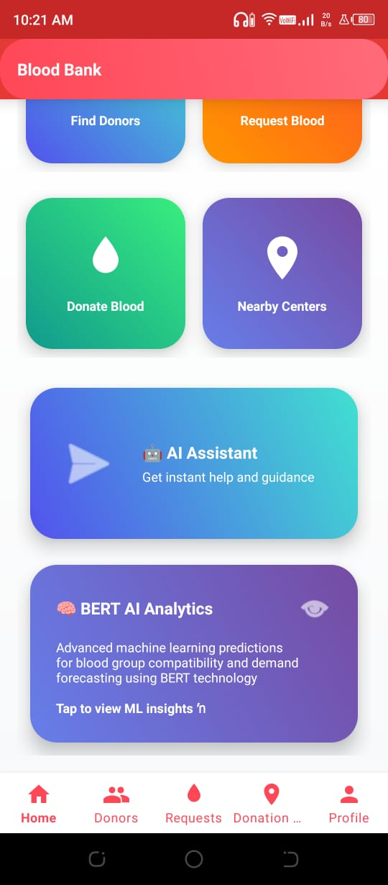

# 🩸 Blood Bank Android Application

A modern, feature-rich Android application designed to connect **blood donors** and **recipients** seamlessly.  
Built using **Kotlin**, **MVVM**, **Room**, **Firebase**, **Google Maps SDK**, and **Material Design 3**, the app ensures real-time updates, donor discovery, request tracking, and cloud synchronization.

---
## 🎬 Demo Video

[](assets/demo/Blood%20Bank.mp4)

---

## 📸 Application Screenshots

### 🔥 Key Screens (Top UI Showcase)

| Login | Registration | Dashboard | UI Interface |
|---|---|---|---|
|  |  |  |  |

| Find Donors | Add Donors | Request Donors | Request Filters |
|---|---|---|---|
|  |  |  |  |

### 📂 Full Feature Screenshots Gallery

| AI Bot | AI Chat Bot | ML Model | App Start Symbol |
|---|---|---|---|
|  |  |  |  |

| Firebase Cloud Messaging | Firebase Project Details | Firebase Users | Firebase Users Sign-In |
|---|---|---|---|
|  |  |  |  |

| Map Integration | Request Screen | Notifications | UI UX Layer |
|---|---|---|---|
|  |  |  |  |

## 📌 Table of Contents
- [Overview](#overview)
- [Features](#features)
- [Technical Stack](#technical-stack)
- [Installation](#installation)
- [Configuration](#configuration)
- [Architecture](#architecture)
- [Screens](#screens)
- [API Integration](#api-integration)
- [Firebase Integration](#firebase-integration)
- [Permissions](#permissions)
- [Testing](#testing)
- [Security](#security)
- [Practical Mapping](#practical-mapping)
- [Folder Structure](#folder-structure)
- [Contributing](#contributing)
- [License](#license)

---

## 🔍 Overview

**Blood Bank App** is an end-to-end Android solution for simplifying blood donation.  
It enables users to:

- Find donors based on blood group & location  
- Send blood requests  
- Get real-time notifications  
- Track donation centers  
- Communicate using multimedia  
- Backup & sync user data in the cloud  

The app follows modern Android development practices, ensuring a clean architecture, scalability, and excellent user experience.

---

## 🚀 Features

### Core Features
👉  User Authentication (Firebase)
👉  Donor Search by blood type & location
👉  Blood Request creation & management
👉  Google Maps integrated donation centers
👉  User profiles & donation history
👉  Real-time notifications
👉  Offline support enabled
👉  Multimedia support: Photos/Videos/Voice Notes


### Advanced Features
👉 Push Notifications (Firebase FCM)
👉 Interactive Google Maps integration
👉 Blood donation news feed (NewsAPI)
👉 Dark Mode
👉 Multi-language Support
👉 Cloud Sync & Backup
👉 CameraX + ExoPlayer support

---

## 🛠 Technical Stack

### Core
👉 Language: Kotlin
👉 Architecture: MVVM + Clean Architecture
👉 Minimum SDK: 24
👉 Target SDK: 34
👉 Dependency Injection: Hilt
👉 Async Processing: Coroutines + Flow
👉 Local Database: Room (SQLite)
👉 Backend: Firebase (Auth, Firestore, Storage, Messaging)


### Libraries
👉 UI: Material Design 3, RecyclerView, ConstraintLayout
👉 Networking: Retrofit, OkHttp, Gson
👉 Image Loading: Glide
👉 Maps: Google Maps SDK
👉 Media: CameraX, ExoPlayer
👉 Background Tasks: WorkManager
👉 Navigation: Android Jetpack Navigation
👉 Testing: JUnit, Espresso, MockK


---

## 📲 Installation

### Prerequisites
- Android Studio Flamingo (2022.2.1) or newer  
- JDK 11+  
- Android SDK 34  
- Google Play Services  

### Clone Repository
```bash
git clone https://github.com/Suman7998/blood-bank-android.git
cd blood-bank-android
```

### **Run the App**

1. Open project in Android Studio
2. Sync Gradle
3. Add `google-services.json` in `app/`
4. Add Maps API key in `res/values/google_maps_api.xml`
5. Run on emulator/device

---

## ⚙ Configuration

### local.properties

```
MAPS_API_KEY=your_api_key_here
NEWS_API_KEY=your_news_api_key_here
```

---

## 🧱 Architecture

The application follows **MVVM + Clean Architecture**, divided into:

### Data Layer

* Repositories
* Local Data Source (Room)
* Remote Data Source (Firebase, APIs)

### Domain Layer

* Use Cases
* Repository Interfaces

### Presentation Layer

* Activities / Fragments
* ViewModels
* UI State via StateFlow

---

## 🖼 Screens

### Authentication

* Splash
* Login
* Register
* Forgot Password

### Main Screens

* Dashboard
* Donor List / Map View
* Request Form
* Donation Centers Map
* User Profile
* Settings

### Additional

* Donation History
* Notifications
* Blood Compatibility Guide
* News Feed

---

## 🌐 API Integration

### NewsAPI

| Endpoint                         | Purpose              |
| -------------------------------- | -------------------- |
| `/everything?q=blood donation`   | Latest donation news |
| `/top-headlines?category=health` | Health headlines     |

### Google Maps

* Nearby blood banks
* Donor location routing
* Real-time positioning

---

## 🔥 Firebase Integration

### Authentication

* Email/Password
* Phone Number
* Google Sign-In
* Anonymous Login

### Firestore Collections

* `users`
* `donors`
* `requests`
* `donation_centers`

### Cloud Messaging

* Blood request alerts
* Emergency notifications

### Storage

* Profile photos
* Media attachments

---

## 📜 Permissions

* `INTERNET`
* `ACCESS_FINE_LOCATION`
* `CAMERA`
* `RECORD_AUDIO`
* `READ_EXTERNAL_STORAGE`
* `CALL_PHONE`

---

## 🧪 Testing

### Unit Tests

* ViewModel
* Repository
* Use Cases

### Instrumentation Tests

* UI (Espresso)
* Navigation
* Local DB Tests (Room)

### Coverage

* 70%+ required

---

## 🔐 Security

* Encrypted SharedPreferences
* HTTPS-only API calls
* Firebase security rules
* ProGuard/R8 enabled
* API key protection
* Input validation
* Certificate pinning (optional)

---

## 🤝 Contributing

1. Fork repository
2. Create feature branch
3. Commit changes
4. Push to branch
5. Submit Pull Request

---

## 📄 License

This project is licensed under the **MIT License**.
See `LICENSE` for more information.

---

## 🙏 Acknowledgments

* Material Design Team
* Android Jetpack
* Firebase
* Google Maps
* NewsAPI
* Open Source Contributors
